# Лабораторная работа №6: Очистка и трансформация данных. pandas (P3124)

## Ссылка на Google Colab Ноутбук
🔗 **[Выполненный Google Colab Ноутбук (режим просмотра)](https://colab.research.google.com/drive/1eiCI9_NQsDmx5mkEnynSRAjAKEbbwtVr?usp=sharing)**

---

## 1. Введение
Целью данной лабораторной работы является изучение и практическое применение методов очистки и трансформации данных с использованием библиотеки `pandas` на языке Python. В качестве исходных данных используется классический датасет пассажиров «Титаника» (`titanic.csv`), содержащий пропуски, неструктурированные текстовые поля и выбросы.

Основные задачи:
* Загрузка набора данных и проведение первичного анализа.
* Обнаружение и обработка пропущенных значений в признаках различных типов.
* Трансформация существующих признаков и конструирование новых (Feature Engineering).
* Обнаружение и обработка статистических выбросов.
* Проведение группировки, агрегации данных и построение сводных таблиц для извлечения полезных инсайтов.
* Визуализация распределений и взаимосвязей между признаками.

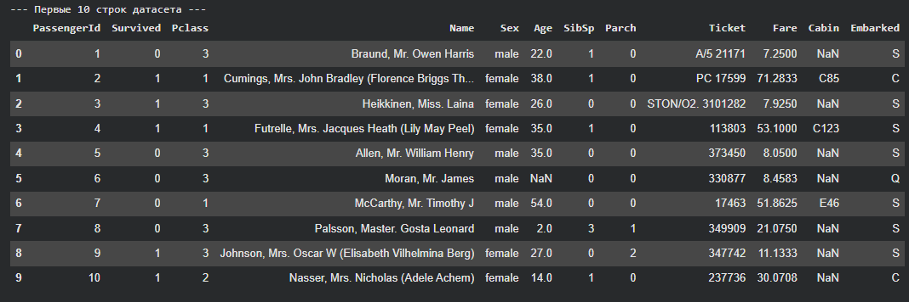

---

## 2. Первичный анализ
На этапе первичного анализа были исследованы структура набора данных, типы данных каждого столбца, общее количество записей и наличие пропущенных значений.

Основные результаты этапа:
* **Типы данных:** датасет состоит из числовых признаков (`int64`, `float64`) и категориальных/текстовых объектов (`object`).
* **Пропущенные значения:** обнаружены значительные пропуски в столбцах `Age` (возраст) — 177, `Cabin` (номер кабины) — 687 и незначительные в `Embarked` (порт посадки) — 2.
* **Описательная статистика:** получены ключевые показатели распределения числовых признаков (среднее, стандартное отклонение, квартили, минимум и максимум).

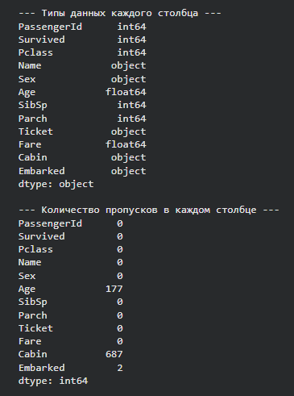
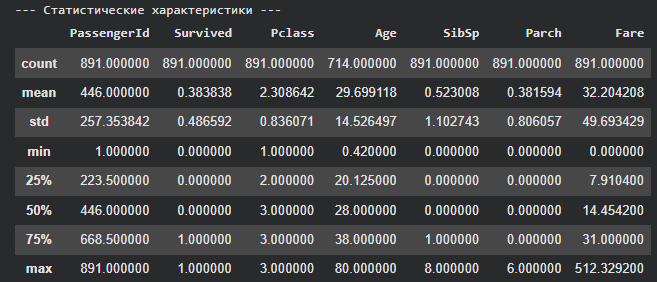

Для визуализации распределения числовых признаков до обработки были построены гистограммы для каждого из столбцов. Они наглядно демонстрируют скошенность распределений (особенно для признаков `Fare` и `Age`) и масштаб признаков.

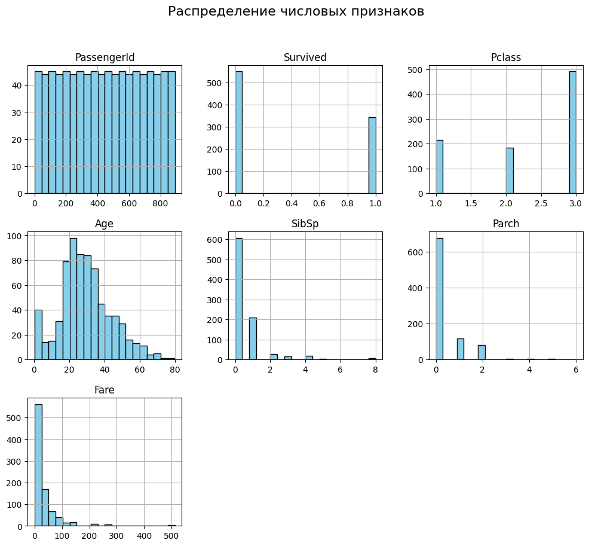

---

## 3. Обработка пропусков
Пропуски в данных могут существенно ухудшить качество прогнозных моделей. На данном этапе была проведена интеллектуальная импутация пропущенных значений:

1. **Возраст (`Age`):** Пропущенные значения заполнены медианным возрастом (28.0 лет), так как медиана устойчива к влиянию выбросов (среднее значение составило 29.70 лет). На основе заполненного признака создан новый категориальный признак **`Age_group`** со следующими интервалами:
   * `Child` (0–12 лет)
   * `Teenager` (12–18 лет)
   * `Adult` (18–60 лет)
   * `Senior` (60–120 лет)
2. **Порт посадки (`Embarked`):** Пропущенные значения заполнены самым частым значением (модой), которым является `'S'` (Southampton).
3. **Кабина (`Cabin`):** Из-за очень большого количества пропусков заполнить их напрямую невозможно. Однако первая буква номера кабины указывает на палубу (**`Deck`**). Были извлечены первые буквы, а пропуски заполнены символом `'U'` (Unknown — неизвестно). После создания признака палубы исходный столбец `Cabin` был удален.

После проведения обработки была сделана контрольная проверка, подтвердившая полное отсутствие пропусков во всех столбцах (все показатели пропусков стали равны 0).

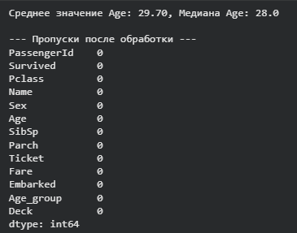

---

## 4. Трансформация данных
Для улучшения качества анализа и подготовки данных к дальнейшему машинному обучению выполнена серия преобразований:

* **Класс обслуживания (`Pclass`):** Значения числового признака `1`, `2` и `3` заменены на категориальные строки `'F'` (First Class), `'S'` (Second Class) и `'T'` (Third Class). Это позволяет анализировать классы как чисто категориальные признаки.
* **Обращение (`Title`):** Из текстового столбца с именами `Name` при помощи регулярного выражения извлечены обращения (например, *Mr, Mrs, Miss, Master*).
* **Пол (`Sex`):** Категориальный признак пола преобразован в числовой формат: `male` $\rightarrow$ `0`, `female` $\rightarrow$ `1`.
* **Размер семьи (`FamilySize`):** Создан новый признак, объединяющий количество родственников на борту: `FamilySize = SibSp + Parch + 1` (где 1 — сам пассажир).
* **Признак одиночества (`IsAlone`):** Бинарный признак, принимающий значение `1`, если пассажир путешествует один (`FamilySize == 1`), и `0` в противном случае.

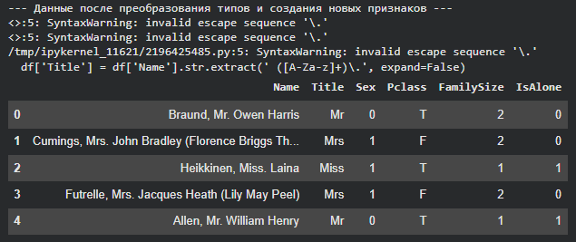

---

## 5. Обработка выбросов
Выбросы могут сильно исказить результаты статистического анализа и обучения моделей. На данном этапе исследованы два ключевых числовых признака — `Fare` (стоимость билета) и `Age` (возраст):

1. **Диаграмма размаха для `Fare`:** Построен Boxplot, который выявил наличие большого количества экстремально высоких значений стоимости билетов (выбросов), лежащих за пределами верхней границы IQR-метода ($Q3 + 1.5 \times IQR$).
2. **Распределение `Age`:** Визуализировано распределение возраста с помощью гистограммы с плотностью ядра (KDE).
3. **Метод Винзоризации (Winsorization):** Для сглаживания влияния аномалий применена замена значений, превышающих 95-й перцентиль, на величину самого 95-го перцентиля. Это позволило сохранить информацию о высоком тарифе/возрасте, но убрать экстремальные пики, искажающие средние показатели.

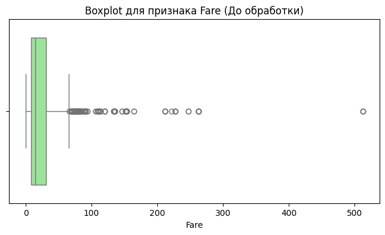
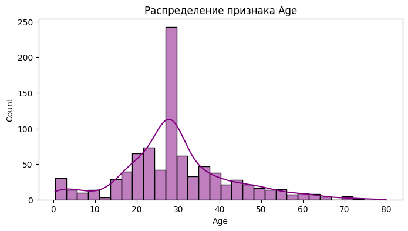

---

## 6. Агрегация и анализ
После очистки и подготовки данных были проведены группировка и расчет ключевых показателей выживаемости:

* **Выживаемость по классам (`Pclass`):** Пассажиры первого класса (`F`) имели самый высокий уровень выживаемости (около 62.96%), второго класса (`S`) — около 47.28%, а третьего класса (`T`) — самый низкий (около 24.24%).
* **Выживаемость по полу и классам:** Внутри каждого класса женщины демонстрируют кардинально более высокую долю выживших по сравнению с мужчинами.
* **Медианный возраст по портам посадки:** Анализ показал различие в возрасте пассажиров в зависимости от порта их посадки (все медианные значения после очистки составили 28.0 лет).
* **Сводная таблица выживаемости (`Age_group` и `IsAlone`):** Показала, что дети (`Child`) имеют наивысшую выживаемость, при этом путешествующие в одиночку взрослые и пожилые люди имеют меньший шанс на спасение по сравнению с теми, у кого на борту были семьи.

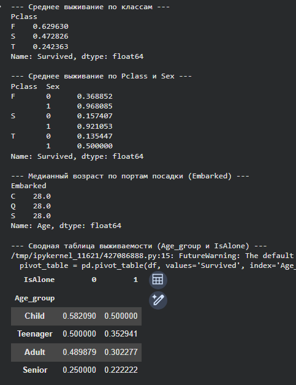
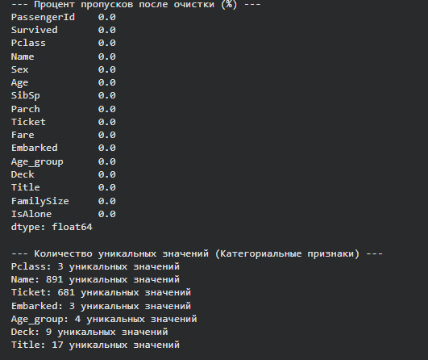

В конце этапа анализа была вычислена описательная статистика после трансформации, получена числовая корреляционная матрица и построена тепловая карта корреляции (Heatmap) между ключевыми числовыми признаками:

* Выявлена сильная отрицательная корреляция между фактом одиночества (`IsAlone`) и размером семьи (`FamilySize`).
* Подтверждена заметная положительная корреляция между выживаемостью (`Survived`) и женским полом (`Sex` = 1).
* Очищенные и трансформированные данные были сохранены в файл `titanic_cleaned.csv` для последующего использования.

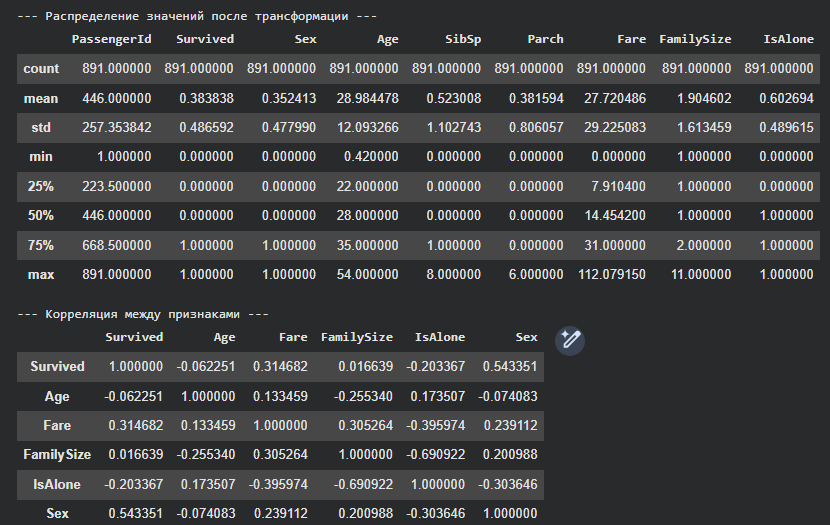
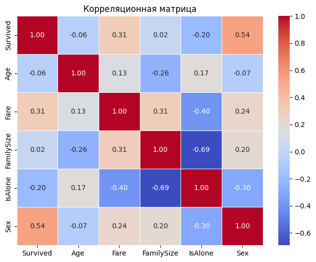

---

## 7. Заключение
В ходе выполнения лабораторной работы были успешно освоены ключевые концепции анализа данных в `pandas`:

1. **Качественная предобработка:** Проанализирована структура данных, устранены пропущенные значения с использованием медианы и моды, а также выполнено извлечение признаков из текстовых полей.
2. **Конструирование признаков (Feature Engineering):** Созданы новые значимые переменные (`FamilySize`, `IsAlone`, `Title`, `Deck`), которые обогатили датасет и улучшили возможности для выявления закономерностей.
3. **Борьба с аномалиями:** Применение метода Винзоризации позволило эффективно нейтрализовать негативное влияние экстремальных выбросов в столбцах `Fare` и `Age` без потери ценной информации.
4. **Анализ зависимостей:** Проведенный агрегационный анализ и построение тепловой карты корреляции позволили сделать важные аналитические выводы (например, о критической роли класса обслуживания и пола в шансах на выживание).

Итоговый очищенный и полностью подготовленный датасет сохранен в файл `titanic_cleaned.csv` и готов к использованию в алгоритмах машинного обучения.